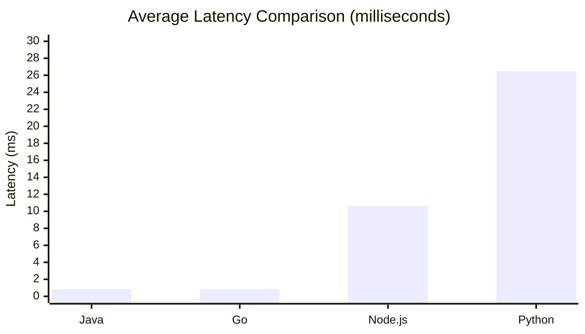

# Java Leads MCP Server Performance Benchmarks with Sub-Millisecond Latency

A comprehensive independent benchmark of MCP server implementations across four major languages puts Java at the top of the performance charts — delivering sub-millisecond latency, the highest throughput, and the best CPU efficiency of all tested platforms.

<!-- more -->

## The Benchmark

[TM Dev Lab](https://www.tmdevlab.com/mcp-server-performance-benchmark.html) published a rigorous performance comparison of MCP server implementations spanning **3.9 million total requests** across three independent test rounds. The benchmark evaluated four implementations under identical conditions:

- **Java** — Spring Boot 4.0.0 + Spring AI 2.0.0-M2 on Java 21
- **Go** — Official MCP SDK v1.2.0
- **Node.js** — @modelcontextprotocol/sdk v1.26.0
- **Python** — FastMCP 2.12.0+ with FastAPI 0.109.0+

Each server was tested with 50 concurrent virtual users over 5-minute sustained runs in Docker containers (1-core CPU, 1GB memory) on Ubuntu 24.04.3 LTS. Four standardized benchmark tools measured CPU-intensive, I/O-intensive, data transformation, and latency-handling scenarios — all with a **0% error rate** across every implementation.

## Java's Performance Highlights

The results speak for themselves:

| Server     | Avg Latency | Throughput (RPS) | CPU Efficiency (RPS/CPU%) |
|------------|-------------|------------------|---------------------------|
| **Java**   | **0.835 ms** | **1,624**       | **57.2**                  |
| Go         | 0.855 ms    | 1,624            | 50.4                      |
| Node.js    | 10.66 ms    | 559              | 5.7                       |
| Python     | 26.45 ms    | 292              | 3.2                       |

Java achieved the **lowest average latency** at 0.835 ms — edging out Go's 0.855 ms — while matching its throughput at 1,624 requests per second. Where Java truly stands out is **CPU efficiency**: at 57.2 RPS per CPU%, it extracts more performance per compute cycle than any other implementation, including Go (50.4).

In CPU-bound workloads like Fibonacci calculation, Java excelled with a **0.369 ms** response time, showcasing the JVM's highly optimized just-in-time compilation.

## A Clear Performance Tier

The benchmark reveals two distinct performance tiers:

- **High-performance tier**: Java and Go deliver sub-millisecond latencies and 1,600+ RPS
- **Standard tier**: Node.js (12x slower) and Python (31x slower) trail significantly

Java's throughput is **2.9x higher than Node.js** and **5.6x higher than Python**. For latency-sensitive MCP deployments, the difference is even more pronounced — Java responds **12.8x faster than Node.js** and **31.7x faster than Python**.

## What This Means for MCP Developers

For teams building production MCP servers that need to handle high concurrency and low-latency tool interactions, Java with Spring Boot and Spring AI provides a battle-tested, high-performance foundation. The JVM's mature ecosystem, strong typing, and proven scalability make it an excellent choice for enterprise MCP deployments where performance and reliability are paramount.

The full benchmark details, methodology, and raw data are available at [TM Dev Lab](https://www.tmdevlab.com/mcp-server-performance-benchmark.html).
